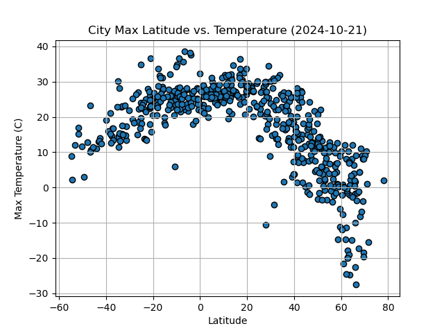
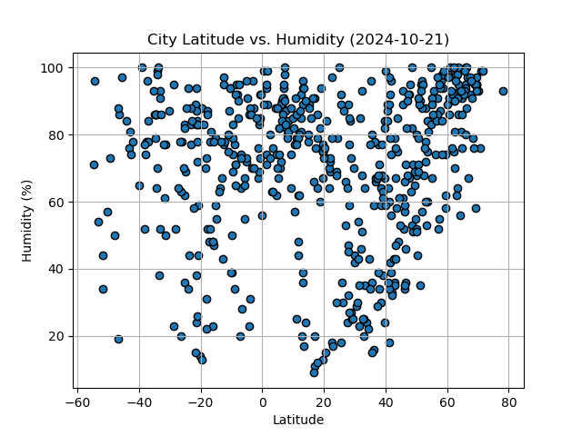
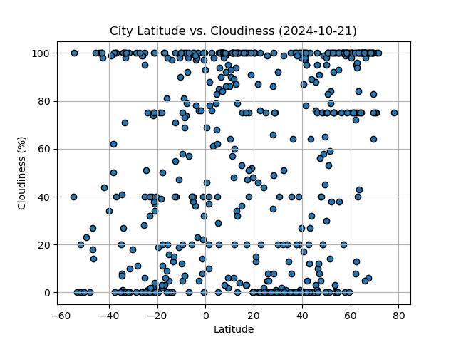
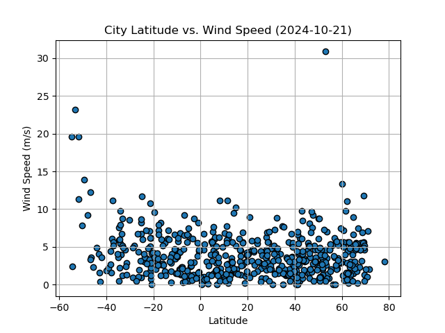

# python-api-challenge
**Objective**: Using Python requests, APIs, and JSON to explore the weather conditions as we approach the equator and leverage city weather data to plan future vacations.

## Prerequisites
- Visual Studio Code
- Python
- Pandas
- NumPy
- Requests
- time
- Matplotlib
- SciPy stats
- citipy
- hvPlot
- API keys (OpenWeatherMap and Geoapify)

## Setup and Usage
1. Clone the `python-api-challenge` repository to your local computer.
2. Navigate to the cloned directory in Visual Studio Code.
3. Open the Jupyter Notebook `WeatherPy.ipynb` to generate random geographic coordinates for a list of cities and view the analysis of the relationships between weather variables and latitude.
4. Open the Jupyter Notebook `VacationPy.ipynb` to load weather, coordinate data, and create interactive maps to display ideal cities and  hotels nearby.

## Output – WeatherPy.ipynb
The Jupyter Notebook analyzes the data and generates the required DataFrames, plots, and interactive maps for the report:
- `cities.csv`: Exported the list of cities and their weather data into a CSV.
- Latitude vs Temperature

- Latitude vs Humidity

- Latitude vs Cloudiness

- Latitude vs Wind Speed

- Linear Regression Plots: Separated into Northern and Southern Hemispheres
  - Temperature vs Latitude: The r^2 values indicate a strong correlation. The maximum temperature increases as we approach the equator.
  - Humidity / Cloudiness / Wind Speed vs Latitude: The r^2 values indicate very weak to no correlation.

## Output – VacatioinPy.ipynb
- `mat_plot_1`: An interactive map that displays a point for every city in the city_data_df DataFrame. The size of the point represents the humidity in each city.
- `mat_plot_2`: An interactive map that displays the name and country of the first hotel located within 10,000 metres of cities that meet your ideal weather conditions.
